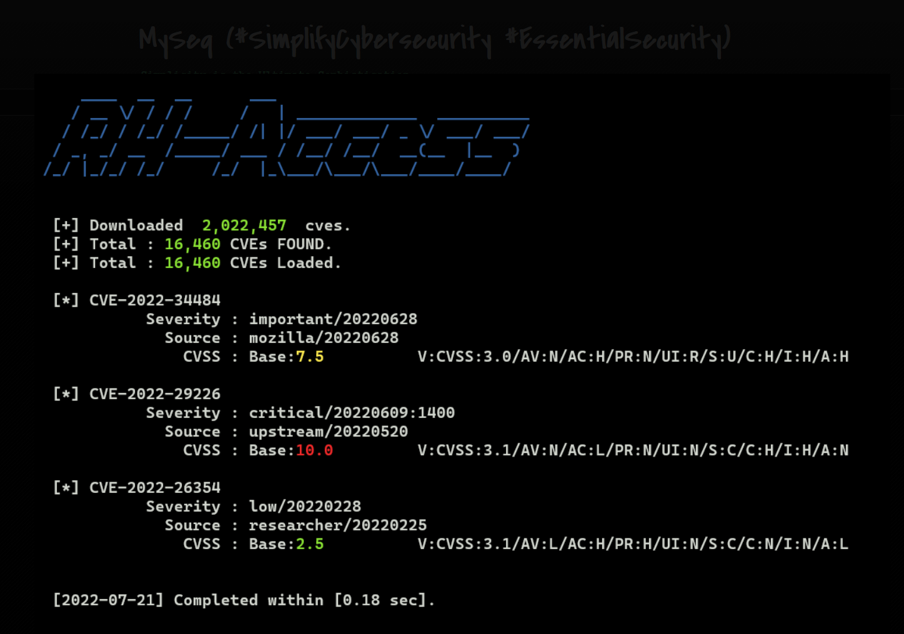

# Utilities
Here are some of the small utilities that I wrote for fun and testing. 

## Utils List

| Script | Functions |
| :----- | :-------- |
| mouse_jiggler.py | A mouse jiggler for prevents it from falling asleep by moving the mouse to simulate human input. |
| isc_dshield.py | To show the ISC Infocon and search for MS patches information. |
| fp_https.py | Fingerprint HTTPS certificate |
| rha_cve_check.py | Retrieve CVE details directly via RedHat Security Data API. |
| rha_cve_check.zip | (Windows executable) Same as `rha_cve_check.py`. |

Some old utils that used to be working:

| Archives | Functions |
| :------- | :-------- |
| 202207_rh_access.py | Search any CVE released by Red Hat. |

### rh_cve_check.py

See `README_RHA_Security_Data.md` for more details.

```console

$  python rha_cve_check.py -h

usage: rha_cve_check.py [-h] [-v] <cve> [<cve> ...]

   Zzzzz   |\      _,,,---,,_
           /,`.-'`'    -.  ;-;;,_   __author__ : [ zd ]
          |,4-  ) )-,_..;\ (  `'-'  __year__   : [ 2024.09 ]
         '---''(_/--'  `-'\_)       __file__   : [ ./rha_cve_check.py ]

         Retrieve CVE details directly via RedHat Security Data API.

         [ base_url = 'https://access.redhat.com/hydra/rest/securitydata' ]

positional arguments:
  <cve>       Specify a CVE or a list of CVEs.

options:
  -h, --help  show this help message and exit
  -v          verbose output

    RedHat Security Data API:

        See https://docs.redhat.com/en/documentation/red_hat_security_data_api/1.0/html-single/red_hat_security_data_api/index

```

### fp_https.py

```bash
$ python fp_https.py edellroot.badssl.com

  [*] Fingerprint-check on https://edellroot.badssl.com:443/ ... 🔍

Certificate
===========
Issued_To: cn=edellroot.badssl.com [ o=BadSSL ]
Issued_By: cn=eDellRoot [ o= ]
   Validity: '2018-05-16 01:58:38 '/'2020-05-15 01:58:38 ' [ Invalid ⚠  ]

Fingerprint: '7e:87:3e:42:88:83:d0:71:34:3e:4c:ac:5a:20:4b:ee:ce:54:89:e0' 👍 [SHA1]

 ⏲  main(): completed within [1.1171 sec].


$ python fp_https.py dsdtestprovider.badssl.com

  [*] Fingerprint-check on https://dsdtestprovider.badssl.com:443/ ... 🔍

Certificate
===========
Issued_To: cn=dsdtestprovider.badssl.com [ o=BadSSL ]
Issued_By: cn=DSDTestProvider [ o=DSDTestProvider ]
   Validity: '2018-05-16 17:15:23 '/'2020-05-15 17:15:23 ' [ Invalid ⚠  ]

Fingerprint: '3d:2c:76:aa:bb:a3:87:93:91:fd:df:5f:b8:cc:96:0c:7e:d7:35:74' 👍 [SHA1]

 ⏲  main(): completed within [0.7591 sec].


$ python fp_https.py www.yahoo.com -v

  [*] Fingerprint-check on https://www.yahoo.com:443/ ... 🔍

Certificate
===========
Serial_No: 3589040345472523812351725689239958504
Issued_To: cn=*.fantasysports.yahoo.com [ o=Yahoo Holdings Inc. ]
Issued_By: cn=DigiCert SHA2 High Assurance Server CA [ o=DigiCert Inc ]
   Validity: '2024-05-30 00:00:00 '/'2024-07-17 23:59:59 ' [ Valid 👍  ]

Public Key : 256 bits
Algo Used  : sha256WithRSAEncryption
Fingerprint: 'f3:6a:4e:6c:29:1f:f3:08:47:c0:5f:a2:7f:d3:d5:c0:01:b5:b7:3f' 👍 [SHA1]
Fingerprint: '91:82:a3:bb:51:87:85:d4:25:1c:f0:ac:f8:32:32:c1:c3:5c:c0:95:9f:06:01:38:d2:b4:7d:98:b0:80:04:ef' 👍 [SHA256]

Alt Name : 'DNS:*.fantasysports.yahoo.com, DNS:ymail.com, DNS:s.yimg.com, DNS:*.yahoo.com, DNS:*.calendar.yahoo.com, DNS:*.groups.yahoo.com,
DNS:*.mail.yahoo.com, DNS:*.msg.yahoo.com, DNS:*.ymail.com, DNS:*.finance.yahoo.com, DNS:*.news.yahoo.com, DNS:de.nachrichten.yahoo.com,
DNS:*.video.yahoo.com, DNS:*.m.yahoo.com, DNS:*.my.yahoo.com, DNS:*.search.yahoo.com, DNS:*.secure.yahoo.com, DNS:*.yahooapis.com, DNS:*.mg.mail.yahoo.com,
DNS:*.api.fantasysports.yahoo.com, DNS:*.autos.yahoo.com, DNS:*.cricket.yahoo.com, DNS:*.football.fantasysports.yahoo.com, DNS:*.games.yahoo.com,
DNS:*.lifestyle.yahoo.com, DNS:*.movies.yahoo.com, DNS:*.mujer.yahoo.com, DNS:*.music.yahoo.com, DNS:*.safely.yahoo.com, DNS:*.screen.yahoo.com,
DNS:*.shine.yahoo.com, DNS:*.sports.yahoo.com, DNS:*.travel.yahoo.com, DNS:*.tv.yahoo.com, DNS:*.weather.yahoo.com, DNS:*.notepad.yahoo.com,
DNS:*.protrade.com, DNS:*.yql.yahoo.com, DNS:*.wc.yahoodns.net, DNS:*.help.yahoo.com, DNS:*.celebrity.yahoo.com, DNS:*.ybp.yahoo.com, DNS:*.geo.yahoo.com,
DNS:*.messenger.yahoo.com, DNS:*.antispam.yahoo.com, DNS:*.ysm.yahoo.com, DNS:video.media.yql.yahoo.com, DNS:*.tripod.yahoo.com, DNS:*.iris.yahoo.com,
DNS:*.mobile.yahoo.com, DNS:*.overview.mail.yahoo.com, DNS:*.mailplus.mail.yahoo.com, DNS:*.xobni.yahoo.com, DNS:onepush.query.yahoo.com,
DNS:api-onepush.query.yahoo.com, DNS:api.digitalhomeservices.yahoo.com, DNS:commsdata.api.yahoo.com, DNS:*.commsdata.api.yahoo.com,
DNS:gallery.tv.widgets.yahoo.com, DNS:*.commerce.yahoo.com, DNS:*.sombrero.yahoo.net, DNS:*.tw.campaign.yahoo.com, DNS:*.dispatcher.yahoo.com,
DNS:cdn.launch3d.com, DNS:cdn.js7k.com, DNS:video-api.sapi.yahoo.com, DNS:manifest.sapi.yahoo.com, DNS:*.vto.commerce.yahoo.com,
DNS:es-us.finanzas.yahoo.com, DNS:br.financas.yahoo.com, DNS:*.dht.yahoo.com, DNS:manifest-bf1.sapi.yahoo.com, DNS:manifest-gq1.sapi.yahoo.com,
DNS:manifest-ir2.sapi.yahoo.com, DNS:manifest-sg3.sapi.yahoo.com, DNS:manifest-ne1.sapi.yahoo.com, DNS:admetrics.uadapp.yahoo.com,
DNS:admetricsqa.uadapp.yahoo.com, DNS:*.gcp.mail.yahoo.com'


 ⏲  main(): completed within [1.1079 sec].

```

<!--
## Screenshots


-->

## Links

 - Access [Security Data](https://access.redhat.com/security/data/) by Red Hat Product Security.

